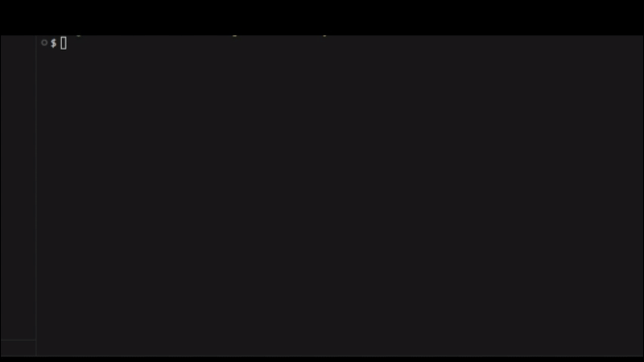

# 📊 sysmetrics

<p align="center">
  A modern, cross-platform library for monitoring system metrics and hardware information, written in TypeScript for Node.js.
</p>

<p align="center">
  <a href="https://www.npmjs.com/package/sysmetrics">
    
  </a>
  <a href="https://github.com/Renato-FO/sysmetrics/actions">
    
  </a>
  <a href="https://opensource.org/licenses/MIT">
    
  </a>
</p>

---

## 🚀 Demonstration

<p align="center">
  
</p>

## ✨ About The Library

`sysmetrics` is a lightweight, zero-dependency library for monitoring system performance and retrieving real-time hardware information. It abstracts away complex, OS-specific commands, providing a clean, asynchronous, and easy-to-use API.

It is designed to be the data collection backbone for monitoring dashboards, predictive AI models, and any application that needs to understand its underlying hardware environment.

---

## 📦 Installation

```bash
npm install sysmetrics
```

_(Note: Package not yet published)_

---

## ⚡ Quick Start

Getting started with `sysmetrics` is simple. Import the main object and call the methods you need.

```typescript
import { sysmetrics } from "sysmetrics";

async function logSystemSnapshot() {
  try {
    // 1. Get static hardware info
    const system = await sysmetrics.getSystemInfo();
    console.log(`System: ${system.cpu} on ${system.motherboard}`);

    // 2. Get dynamic metrics
    const cpuUsage = await sysmetrics.getCpuUsage();
    const ram = await sysmetrics.getMemoryUsage();

    // 3. Get GPU metrics
    // The getGpuInfo() function returns an object with specific methods
    const gpuController = sysmetrics.getGpuInfo();
    const gpuStats = await gpuController.getCurrentGpuStats();

    console.log(`\nCPU: ${cpuUsage}% | RAM: ${ram.used}MB / ${ram.total}MB`);
    console.log(`GPU: ${system.gpu}`);
    console.log(
      `  - Temp: ${gpuStats.temperature}°C, VRAM Used: ${gpuStats.vramUsed}MB`
    );

    // 4. Get top memory-consuming processes
    const topProcesses = await sysmetrics.getTopProcesses({ sortBy: "memory" });
    console.log("\nTop Memory Processes:", topProcesses);
  } catch (error) {
    console.error("Failed to fetch metrics:", error);
  }
}

logSystemSnapshot();
```

---

## 📋 Features

- **✅ System Information:** Get static data about your CPU, Motherboard, and GPU.
- **✅ CPU Monitoring:** Track real-time percentage usage.
- **✅ RAM Monitoring:** View total, used, and free memory.
- **✅ GPU Monitoring:**
  - Smart vendor detection (NVIDIA, AMD, Intel, Apple).
  - Provides temperature, VRAM usage, and GPU load data (where available).
- **✅ Process Analysis:** List top resource-consuming processes, aggregated by application.
- **✅ Full Cross-Platform Support:** Fully functional on Windows, Linux, and macOS.

| Metric          | Windows | Linux | macOS |
| :-------------- | :-----: | :---: | :---: |
| **Static Info** |   ✅    |  ✅   |  ✅   |
| **CPU / RAM**   |   ✅    |  ✅   |  ✅   |
| **Processes**   |   ✅    |  ✅   |  ✅   |
| **GPU Metrics** |   ✅    |  ✅   |  ✅   |

---

## 🤝 Contributing

Contributions are what make the open-source community such an amazing place to learn, inspire, and create. Any contributions you make are **greatly appreciated**.

1.  Fork the Project
2.  Create your Feature Branch (`git checkout -b feature/AmazingFeature`)
3.  Commit your Changes (`git commit -m 'Add some AmazingFeature'`)
4.  Push to the Branch (`git push origin feature/AmazingFeature`)
5.  Open a Pull Request

---

## 📜 License

Distributed under the MIT License. See `LICENSE` for more information.
